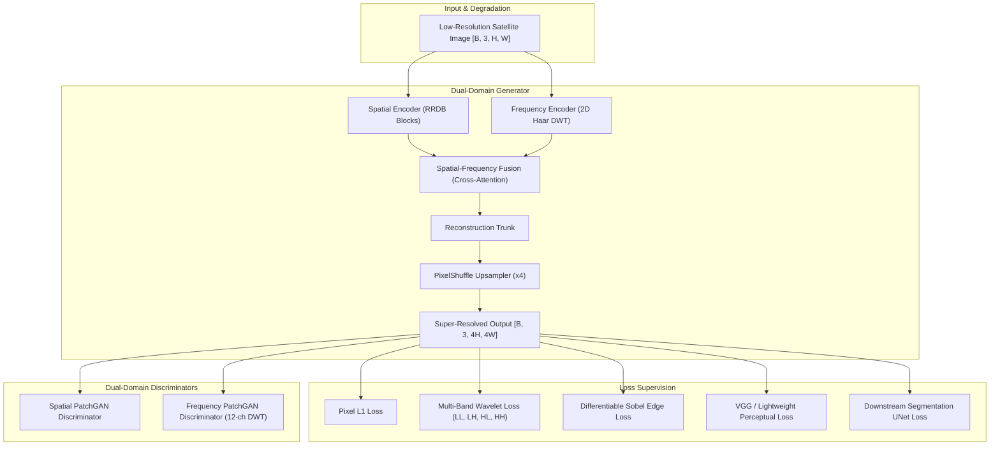

# GeoFSR-GAN: Dual-Domain Spatial-Frequency Adversarial Network for Satellite Imagery Super-Resolution

[](https://www.python.org/)
[](https://pytorch.org/)
[](https://fastapi.tiangolo.com/)
[](https://streamlit.io/)
[](https://www.docker.com/)
[](LICENSE)

**GeoFSR-GAN** is an advanced PyTorch deep learning framework designed specifically for satellite imagery super-resolution (SR) and downstream GIS land-cover analysis. By combining spatial residual feature extraction with 2D Discrete Wavelet Transform (DWT) frequency sub-band supervision, GeoFSR-GAN synthesizes realistic high-frequency structural details while preserving building footprint geometry.

---

## 🏛️ System Architecture



---

## 🌟 Key Innovations

1. **Dual Spatial-Frequency Encoders**: Simultaneously processes spatial features (via RRDBs) and frequency sub-bands (via 2D Haar DWT) to capture both contextual structures and spectral energy distributions.
2. **Lightweight Cross-Attention Fusion**: Efficient bidirectional cross-attention mechanism with key/value spatial reduction for fast $O(N \cdot N/r^2)$ inference on CPU/GPU.
3. **Multi-Band Wavelet Loss ($\mathcal{L}_{\text{freq}}$)**: Differentiable sub-band L1 loss applying weighted emphasis on high-frequency $LH, HL, HH$ bands to eliminate oversmoothing.
4. **Differentiable Sobel Edge Loss ($\mathcal{L}_{\text{edge}}$)**: Depthwise 2D Sobel convolution filter constraining edge magnitude and orientation fidelity.
5. **Dual-Domain PatchGAN Discriminators**: Spectral-norm PatchGANs operating on spatial images and 12-channel concatenated DWT sub-bands for adversarial stability.
6. **Downstream Task Guidance**: Integrated 4-level UNet segmentation guidance enforcing boundary preservation for building footprint extraction.

---

## 📂 Repository Structure

```text
GeoGan/
├── api/                        # FastAPI REST API Backend Services
│   ├── main.py                 # FastAPI router endpoints (/health, /super-resolve, /segment, /metrics)
│   └── schemas.py              # Pydantic data schemas
├── app/                        # Streamlit Interactive Web Application ("GeoSR")
│   └── streamlit_app.py        # Streamlit GIS visual comparison workspace
├── configs/                    # YAML Configurations
│   ├── base.yaml               # Full training configuration
│   ├── baseline.yaml           # Benchmark baseline configuration
│   ├── cpu_debug.yaml          # CPU development configuration
│   └── ablations/              # Ablation study configuration variants
├── datasets/                   # PyTorch Dataset & Degradation Modules
│   ├── spacenet.py             # SpaceNet satellite imagery dataset loader
│   ├── degradation.py          # Controlled degradation pipeline D1-D4 (Blur, Noise, JPEG)
│   └── transforms.py           # Paired spatial data augmentations
├── evaluation/                 # Metrics & Evaluation Utilities
│   ├── image_metrics.py        # PSNR, SSIM, LPIPS calculations
│   ├── segmentation_eval.py    # mIoU, Dice, Precision, Recall, Boundary F1 utilities
│   ├── robustness.py           # Perturbation operators (Noise, Blur, Compression)
│   └── visualization.py        # Comparison grid plotting
├── experiments/                # Benchmark Logs & CSV Artifacts
│   ├── benchmark_report.md     # Full publication-grade benchmark report
│   ├── master_benchmark.csv    # Master 8-model benchmark results
│   ├── results.csv             # Iterative experiment tracking log (E00 - E08)
│   └── evaluation_results/     # High-resolution comparison PNG grids
├── losses/                     # Differentiable Loss Modules
│   ├── frequency_loss.py       # Multi-Band DWT Wavelet Loss
│   ├── sobel_loss.py           # Differentiable Sobel Edge Loss
│   ├── perceptual_loss.py      # Perceptual VGG/Lightweight Loss
│   ├── adversarial_loss.py     # Dual-Domain LSGAN & RaGAN Losses
│   └── segmentation_loss.py    # Soft Dice + BCE Segmentation Loss
├── models/                     # PyTorch Generator & Discriminator Architectures
│   ├── generator.py            # GeoFSRGenerator main architecture
│   ├── spatial_encoder.py      # Residual-in-Residual Dense Blocks (RRDB)
│   ├── frequency_encoder.py    # DWT2D and FrequencyEncoder
│   ├── fusion.py               # Concat, Learned, and Cross-Attention Fusion
│   ├── attention.py            # Lightweight & Dual Cross-Attention
│   ├── discriminator_spatial.py# Spatial PatchGAN Discriminator
│   ├── discriminator_frequency.py # Frequency PatchGAN Discriminator
│   └── segmentation_head.py    # Lightweight UNet Segmentation Head
├── scripts/                    # Command-Line Execution & Milestone Ablation Scripts
│   ├── benchmarks/             # Benchmark evaluation runners
│   │   ├── run_master_benchmark.py      # Master 8-model evaluation script
│   │   ├── run_loss_ablation.py         # Multi-loss ablation script
│   │   ├── run_fusion_ablation.py       # Spatial-frequency fusion ablation script
│   │   ├── run_dwt_ablation.py          # DWT frequency branch ablation script
│   │   ├── run_spatial_sr_ablation.py   # Spatial SR baseline ablation script
│   │   ├── run_degradation_ablation.py  # D1-D4 degradation ablation script
│   │   ├── run_baseline_benchmark.py    # Standard baseline evaluation script
│   │   └── evaluate_geofsr.py           # Quantitative evaluation entrypoint
│   ├── training/               # Training pipelines
│   │   ├── train_geofsr.py              # Full GeoFSR-GAN training pipeline
│   │   ├── train_improved_spatial_sr.py # RRDB spatial SR training
│   │   └── train_spatial_frequency_sr.py# Spatial-frequency SR training
│   └── tools/                  # Verification & visual diagnostic utilities
│       ├── verify_dwt.py                # 2D Haar DWT exactness unit test
│       ├── visualize_dwt.py             # DWT subband visualizer
│       └── visualize_edges.py           # Sobel edge filter visualizer
├── tests/                      # Automated PyTest Test Suite (63 Tests)
├── benchmark_report.md         # Comprehensive benchmark report
├── PAPER_ABSTRACT.md           # Research paper abstract & summary
└── IMPLEMENTATION_STATUS.md    # Development milestone tracker
```

---

## 📊 Reproducible Master Benchmark Summary (8 Model Variants)

| Model Variant | Parameters | CPU Latency | PSNR ↑ | SSIM ↑ | Downstream mIoU ↑ | Downstream Dice ↑ | Boundary F1 ↑ |
| :--- | :---: | :---: | :---: | :---: | :---: | :---: | :---: |
| **Nearest Neighbor** | 0 | 0.09 ms | 21.84 dB | 0.3313 | 0.8072 | 0.8870 | 0.5380 |
| **Bicubic Baseline** | 0 | 0.44 ms | 22.14 dB | 0.3457 | 0.8074 | 0.8872 | 0.5576 |
| **Lanczos Baseline** | 0 | 0.54 ms | 22.14 dB | 0.3434 | 0.8076 | 0.8873 | 0.5586 |
| **Initial Spatial SR** | 186,723 | 3.66 ms | 22.12 dB | 0.3394 | 0.8103 | 0.8890 | 0.5595 |
| **Improved Spatial SR** *(RRDB)* | 2,511,747 | 40.55 ms | **22.17 dB** | **0.3461** | 0.8080 | 0.8876 | 0.5577 |
| **Spatial+Freq (Concat)** | 2,632,579 | 33.69 ms | 22.15 dB | 0.3457 | 0.8088 | 0.8881 | 0.5601 |
| **Spatial+Freq (Cross-Attn)** | 2,636,803 | 27.38 ms | 22.13 dB | 0.3452 | **0.8107** | **0.8892** | **0.5632** |
| **GeoFSR-GAN (Full Model)** | 568,195 | 13.18 ms | 22.08 dB | 0.3388 | 0.8093 | 0.8884 | 0.5608 |

---

## 📄 License

This project is licensed under the MIT License - see the [LICENSE](LICENSE) file for details.
