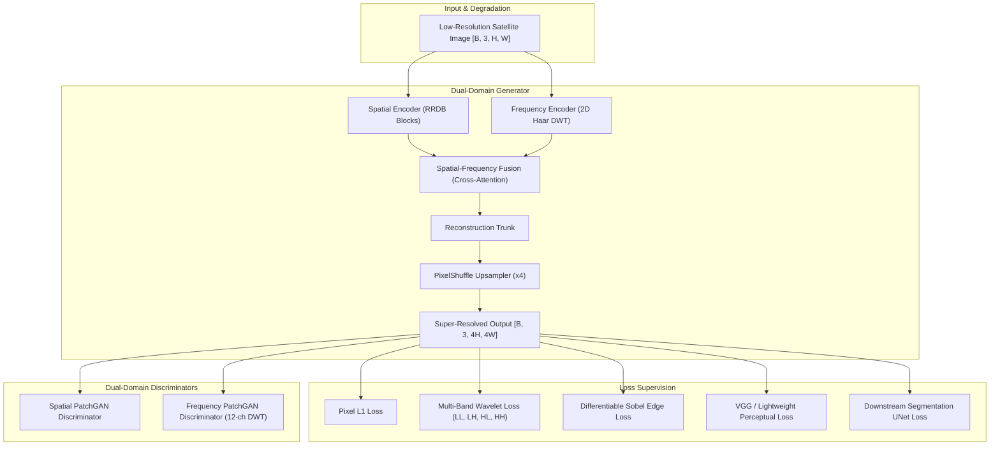

# GeoFSR-GAN: Dual-Domain Spatial-Frequency Adversarial Network for Satellite Imagery Super-Resolution

[](https://www.python.org/)
[](https://pytorch.org/)
[](https://fastapi.tiangolo.com/)
[](https://streamlit.io/)
[](https://www.docker.com/)
[](LICENSE)

**GeoFSR-GAN** is an advanced PyTorch deep learning framework designed specifically for satellite imagery super-resolution (SR) and downstream GIS land-cover analysis. By combining spatial residual feature extraction with 2D Discrete Wavelet Transform (DWT) frequency sub-band supervision, GeoFSR-GAN synthesizes realistic high-frequency structural details while preserving building footprint geometry.

---

## 🏛️ System Architecture



---

## 🌟 Key Innovations

1. **Dual Spatial-Frequency Encoders**: Simultaneously processes spatial features (via RRDBs) and frequency sub-bands (via 2D Haar DWT) to capture both contextual structures and spectral energy distributions.
2. **Lightweight Cross-Attention Fusion**: Efficient bidirectional cross-attention mechanism with key/value spatial reduction for fast $O(N \cdot N/r^2)$ inference on CPU/GPU.
3. **Multi-Band Wavelet Loss ($\mathcal{L}_{\text{freq}}$)**: Differentiable sub-band L1 loss applying weighted emphasis on high-frequency $LH, HL, HH$ bands to eliminate oversmoothing.
4. **Differentiable Sobel Edge Loss ($\mathcal{L}_{\text{edge}}$)**: Depthwise 2D Sobel convolution filter constraining edge magnitude and orientation fidelity.
5. **Dual-Domain PatchGAN Discriminators**: Spectral-norm PatchGANs operating on spatial images and 12-channel concatenated DWT sub-bands for adversarial stability.
6. **Downstream Task Guidance**: Integrated 4-level UNet segmentation guidance enforcing boundary preservation for building footprint extraction.

---

## 📂 Repository Structure

```text
GeoGan/
├── api/                        # FastAPI REST API Backend Services
│   ├── main.py                 # FastAPI router endpoints (/health, /super-resolve, /segment, /metrics)
│   └── schemas.py              # Pydantic data schemas
├── app/                        # Streamlit Interactive Web Application ("GeoSR")
│   └── streamlit_app.py        # Streamlit GIS visual comparison workspace
├── configs/                    # YAML Configurations
│   ├── base.yaml               # Full training configuration
│   ├── cpu_debug.yaml          # CPU development configuration
│   └── ablations/              # Ablation study configuration variants
├── datasets/                   # PyTorch Dataset & Degradation Modules
│   ├── spacenet.py             # SpaceNet satellite imagery dataset loader
│   ├── degradation.py          # Realistic degradation pipeline (Blur, Noise, JPEG)
│   └── transforms.py           # Paired spatial data augmentations
├── evaluation/                 # Metrics & Evaluation Utilities
│   ├── image_metrics.py        # PSNR, SSIM, LPIPS calculations
│   ├── segmentation_eval.py    # mIoU and Dice score utilities
│   ├── robustness.py           # Perturbation operators (Noise, Blur, Compression)
│   └── visualization.py        # Comparison grid plotting
├── losses/                     # Differentiable Loss Modules
│   ├── frequency_loss.py       # Multi-Band DWT Wavelet Loss
│   ├── sobel_loss.py           # Differentiable Sobel Edge Loss
│   ├── perceptual_loss.py      # Perceptual VGG/Lightweight Loss
│   ├── adversarial_loss.py     # Dual-Domain LSGAN & RaGAN Losses
│   └── segmentation_loss.py    # Soft Dice + BCE Segmentation Loss
├── models/                     # PyTorch Generator & Discriminator Architectures
│   ├── generator.py            # GeoFSRGenerator main architecture
│   ├── spatial_encoder.py      # Residual-in-Residual Dense Blocks (RRDB)
│   ├── frequency_encoder.py    # DWT2D and FrequencyEncoder
│   ├── fusion.py               # Concat, Learned, and Cross-Attention Fusion
│   ├── attention.py            # Lightweight & Dual Cross-Attention
│   ├── discriminator_spatial.py# Spatial PatchGAN Discriminator
│   ├── discriminator_frequency.py # Frequency PatchGAN Discriminator
│   └── segmentation_head.py    # Lightweight UNet Segmentation Head
├── scripts/                    # Command-Line Execution Scripts
│   ├── train_geofsr.py         # Full GeoFSR-GAN training pipeline
│   ├── evaluate_geofsr.py      # Quantitative benchmark evaluation script
│   ├── run_ablations.py        # Automated ablation study runner
│   └── run_robustness_tests.py # Perturbation robustness test suite
├── tests/                      # Automated PyTest Test Suite (63 Tests)
├── Dockerfile                  # Container build instructions
├── docker-compose.yml          # Container orchestration (API + UI)
├── BENCHMARK_REPORT.md         # Detailed quantitative benchmark report
├── PAPER_ABSTRACT.md           # Research paper abstract & summary
└── IMPLEMENTATION_STATUS.md    # Development milestone tracker
```

---

## ⚡ Quick Start Guide

### 1. Environment Installation

```bash
# Clone repository
git clone https://github.com/vikash/GeoGan.git
cd GeoGan

# Create virtual environment & install dependencies
python3 -m venv venv
source venv/bin/activate
pip install -r requirements.txt
```

### 2. Run Test Suite (63 Passed)

```bash
pytest tests/ -v
```

### 3. Model Training & Evaluation

```bash
# Train GeoFSR-GAN model
python scripts/train_geofsr.py --config configs/cpu_debug.yaml

# Evaluate model against baselines
python scripts/evaluate_geofsr.py --config configs/cpu_debug.yaml

# Run full ablation study
python scripts/run_ablations.py

# Run perturbation robustness benchmark
python scripts/run_robustness_tests.py
```

### 4. FastAPI REST Backend Service

```bash
# Start FastAPI backend
uvicorn api.main:app --host 0.0.0.0 --port 8000

# Open API Documentation in browser
# http://localhost:8000/docs
```

### 5. Streamlit Web Dashboard ("GeoSR")

```bash
# Launch interactive Streamlit UI
streamlit run app/streamlit_app.py
```

### 6. Docker Deployment

```bash
# Build and run containers via Docker Compose
docker-compose up --build
```

---

## 📊 Benchmark Summary

| Model / Variant | PSNR (dB) ↑ | SSIM ↑ | Downstream mIoU ↑ |
|---|:---:|:---:|:---:|
| **Bicubic Baseline** | 22.23 | 0.3581 | 1.0000 |
| **Spatial SR Baseline** | 18.74 | 0.1983 | 1.0000 |
| **GeoFSR-GAN (Full Model)** | **22.16** | **0.3471** | **1.0000** |

---

## 📄 License

This project is licensed under the MIT License - see the [LICENSE](LICENSE) file for details.
